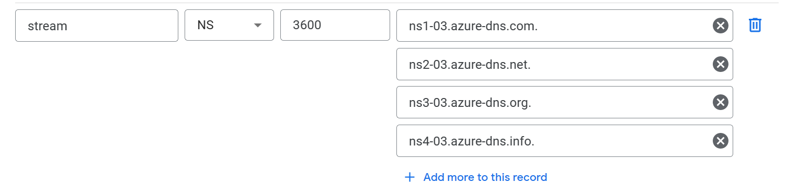
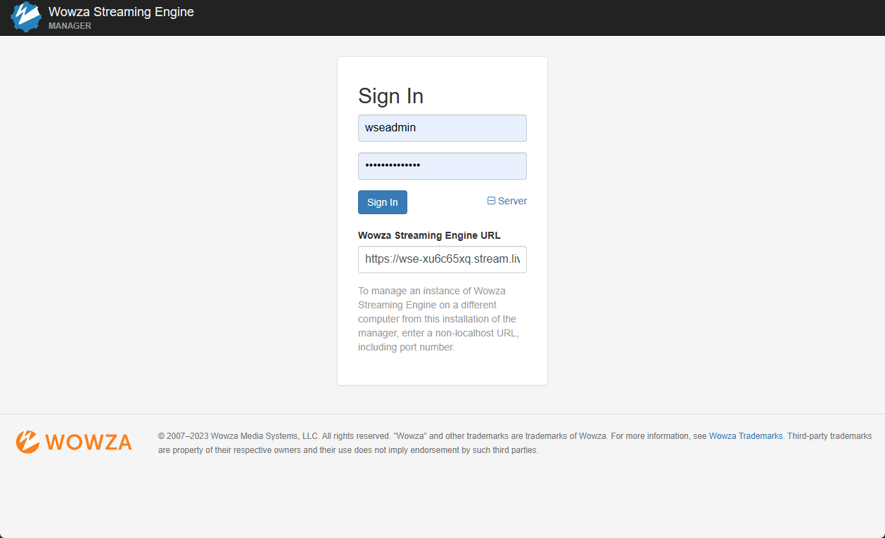
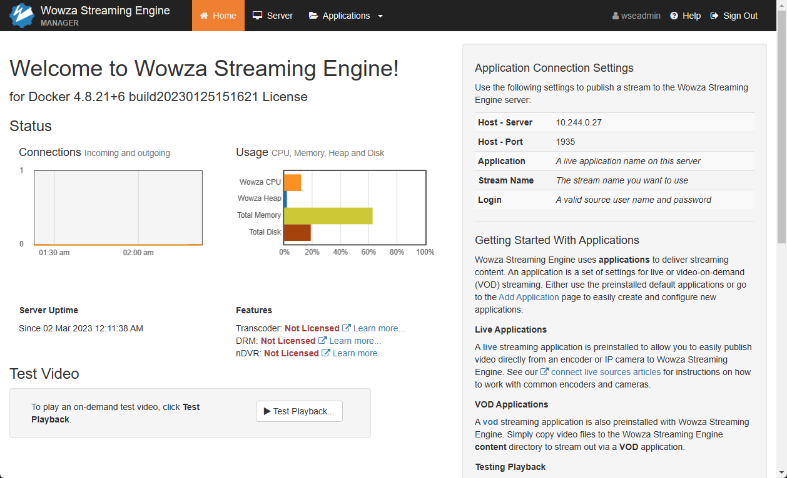

# Deploy Wowza Straming Engine to AKS (Azure Kubernetes Services)

This document explains how to deploy Wowza Streaming Engine instance to a K8S (Kubernetes) cluster on AKS (Azure Kubernetes Services).

## Overview

TBD

## Prerequisites

### Prepare your Azure Tools & Subscription

* Install Kubernetes CLI tools (kubectl and helm)

* Install `cert-manager` command-line tool (`cmctl`). Here is a referece article: [How to install `cert-manager` CLI](https://cert-manager.io/docs/reference/cmctl/)

* Install Azure CLI
  * Please install Azure CLI to your local computer. Here is a reference article : [How to install Azure CLI](https://learn.microsoft.com/en-us/cli/azure/install-azure-cli-linux?pivots=apt)
  * Login to your Azure Subscription with Azure CLI.

    ```shell
    az login --use-device-code
    ```

* Enable Azure CLI Extension for AKS Preview
  * Run the following command:

    ```shell
    az extension add --name aks-preview
    az extension update --name aks-preview
    ```

* Enable **Azure AD Pod Identity** feature in your Azure subscription. This feature is required to allow [External DNS](https://github.com/kubernetes-sigs/external-dns/) to publish DNS names when deploying cluster public endpoints. See more detauls at [this Azure documentation article](https://learn.microsoft.com/en-us/azure/aks/use-azure-ad-pod-identity)

  1. Run the following command to register the EnablePodIdentityPreview feature flag which is required for this AKS cluster configurations.

        ```shell
        az feature register --namespace "Microsoft.ContainerService" --name "EnablePodIdentityPreview"
        ```

  2. Check if the feature 'EnablePodIdentityPreview' is registered by the following command:

        ```shell
        az feature list -o table --query "[?contains(name, 'Microsoft.ContainerService/EnablePodIdentityPreview')].{Name:name,State:properties.state}"
        ```

        Once the feature is registered, you will get the following output.

        ```text
        Name                                                 State
        ---------------------------------------------------  ----------
        Microsoft.ContainerService/EnablePodIdentityPreview  Registered
        ```

  3. Once the feature 'EnablePodIdentityPreview' is registered, run the following command to get the change propagated:

        ```shell
        az provider register --namespace Microsoft.ContainerService
        ```

* Enable **Workload Identity** feature in your Azure subscription. This feature is required to allow [Cert Manager](https://cert-manager.io/) to issue certificates with DNS authentication. See more details at [this Azure documentation article](https://learn.microsoft.com/en-us/azure/aks/workload-identity-deploy-cluster)

  1. Run the following command to register the EnableWorkloadIdentityPreview feature flag which is required for this AKS cluster configurations.

        ```shell
        az feature register --namespace "Microsoft.ContainerService" --name "EnableWorkloadIdentityPreview"
        ```

  2. Check if the feature 'EnableWorkloadIdentityPreview' is registered by the following command:

        ```shell
        az feature list -o table --query "[?contains(name, 'Microsoft.ContainerService/EnableWorkloadIdentityPreview')].{Name:name,State:properties.state}"
        ```

        Once the feature is registered, you will get the following output.

        ```text
        Name                                                      State
        --------------------------------------------------------  ----------
        Microsoft.ContainerService/EnableWorkloadIdentityPreview  Registered
        ```

  3. Once the feature 'EnableWorkloadIdentityPreview' is registered, run the following command to get the change propagated:

        ```shell
        az provider register --namespace Microsoft.ContainerService
        ```

### Prepare your custom parameters

Please create your `.env` file to this repository root directory.

| Environment Variables | Description |
| --------------------- | ----------- |
| DOMAIN_NAME | Your own domain managed with Kubernetes |
| AKS_SUBSCRIPTION_ID | Your Azure Subscription ID |
| AKS_RESOURCE_GROUP | Your placeholder Resource Group name for your AKS related resources |
| AKS_NODE_RESOURCE_GROUP | A Resource Group name for your AKS cluster node resources |
| AKS_LOCATION | A datacenter location for your AKS related resources |
| K8S_CLUSTER | Your AKS cluster resource name |
| K8S_CM_NAMESPACE | A Kubernetes namespace for `cert-manager` |
| K8S_CM_LETENCRYPT_EMAIL_ADDRESS | Your email address for Let's Encrypt certificate issuer |
| K8S_AZURE_DNS_ZONE_WORKLOAD_IDENTITY | |
| K8S_AZURE_DNS_ZONE_POD_IDENTITY | |
| K8S_AZURE_DNS_ZONE_POD_IDENTITY_SECRET_NAME |  |

## 1. Setup AKS Cluster

### 1.1. Create a resource group for AKS cluster and related resources

First of all, you will need to have a placeholder group to store multiple Azure resources required for Azure Kunernetes Cluster.

Please run the following command to create a resource group:

```shell
<somewhere>/wowza-streaming-engine-k8s/azure$ ./create_aks_resource_group.sh
```

### 1.2. Create a DNS zone for your public services

You will deploy HTTP/HTTPS services with a publicly accessible domain name, so you will need to register a domain unless you already have one. You could use any domain name registrar to register a domain name for your site.

Here we will use Azure DNS zone for a new sub domain name (`stream.liveinstantly.cloud`) under our domain name (`liveinstantly.cloud`) to manage DNS records automatically by Kubernetes. You should choose your own domain name.

You can create your sub domain in Azure DNS zone with the following command:

```shell
<somewhere>/wowza-streaming-engine-k8s/azure$ ./create_aks_domain_zone.sh
```

The output of the command contains `nameServer` information of Azure DNS as below. You will need to delegate the sub domain to Azure DNS by adding a NS record for this sub domain name in your domain registrar and pointing the Azure DNS servers for your sub domain name.

```json
{
    ...
  "name": "stream.liveinstantly.cloud",
  "nameServers": [
    "ns1-03.azure-dns.com.",
    "ns2-03.azure-dns.net.",
    "ns3-03.azure-dns.org.",
    "ns4-03.azure-dns.info."
  ],
    ...
}
```

DNS sub domain configuration in your domain registrar is to add a NS record like below:


Once you have configured delegation for your sub domain, you can verify the name resolution with the following command:

```shell
export DOMAIN_NAME=[your-subdomain-name]
dig $DOMAIN_NAME ns +nodnssec
```

The output for our sub domain (`stream.liveinstantly.cloud`) is as below:

```text
; <<>> DiG 9.18.1-1ubuntu1.3-Ubuntu <<>> stream.liveinstantly.cloud ns +nodnssec
   :
;; QUESTION SECTION:
;stream.liveinstantly.cloud.    IN      NS

;; ANSWER SECTION:
stream.liveinstantly.cloud. 172800 IN   NS      ns2-03.azure-dns.net.
stream.liveinstantly.cloud. 172800 IN   NS      ns3-03.azure-dns.org.
stream.liveinstantly.cloud. 172800 IN   NS      ns4-03.azure-dns.info.
stream.liveinstantly.cloud. 172800 IN   NS      ns1-03.azure-dns.com.

;; ADDITIONAL SECTION:
ns1-03.azure-dns.com.   1770    IN      A       40.90.4.3
ns2-03.azure-dns.net.   1499    IN      A       64.4.48.3
ns3-03.azure-dns.org.   2071    IN      A       13.107.24.3
ns4-03.azure-dns.info.  1908    IN      A       13.107.160.3

;; Query time: 80 msec
```

### 1.3. Create an AKS Cluster

Please run the following command to create a new AKS (Azure Kubernetes Services) cluster:

```shell
<somewhere>/wowza-streaming-engine-k8s/azure$ ./create_aks_cluster.sh
```

This shell script will enable both POD Identity and Workload Identity features in the new AKS cluster.

You can verify K8S cluster setup with the following command:

```shell
kubectl get deployments -A -o wide
kubectl get pods -A -o wide
kubectl get nodes -o wide
```

## 2. Setup Identities

## 2.1. Create a POD Identity in Azure

`external-dns` helps to publish DNS names when publishing your public services in Kubernetes cluster. For publishing DNS names in Azure DNS, `external-dns` needs to use the Azure API and manipulate the records in the Azure DNS zone, and it needs an Azure account and the best type of account to use is called a "**Managed Identity**". This account does not come with a password or an API key and it is designed for use by machines and/or services.

This Managed Identity is used to allow `external-dns` managing Azure DNS zone resources. `external-dns` supports Azure AD POD Identity to manage Azure resources from the pod.

> NOTE: `external-dns` does not support Workload Identity currently, but Microsoft recommends to use Workload Identity instead of POD Identity to manage Azure resources (Please see **Note** in [this reference](https://learn.microsoft.com/en-us/azure/aks/use-azure-ad-pod-identity) from Microsoft). `external-dns` may support Workload Identity in near future.

```shell
<somewhere>/wowza-streaming-engine-k8s/azure$ ./generate_pod_identity.sh
```

## 2.2. Create a Workload Identity in Azure

When `cert-manager` creates a certificate using Let's Encrypt it can use DNS records to prove that it controls the DNS domain names in the certificate. In order for `cert-manager` to use the Azure API and manipulate the records in the Azure DNS zone, it needs an Azure account and the best type of account to use is called a "**Managed Identity**". This account does not come with a password or an API key and it is designed for use by machines and/or services.

This Workload Identity is used to allow `cert-manager` managing Azure DNS Zone resources as explained above. To create Workload Identity, run the following command:

```shell
<somewhere>/wowza-streaming-engine-k8s/azure$ ./generate_workload_identity.sh
```

## 3. Setup Cert Manager

### 3.1. Install cert-manager components

Please run the following command to install `cert-manager` to your AKS cluster:

```shell
<somewhere>/wowza-streaming-engine-k8s/azure$ ./install_certmanager.sh
```

This will create three Deployments (`cert-manager`, `cert-manager-cainjector`, and `cert-manager-webhook`) and Pods and two Services in a new namespace called `cert-manager`. It also installs various cluster-scoped resources such as RBAC roles and Custom Resource Definitions.

You can verify cert-manager setup with the following command:

```shell
kubectl -n cert-manager get all
```

Also you can check Workload Identity integration with `cert-manager` with the following command:

```shell
kubectl describe pod -n cert-manager -l app.kubernetes.io/component=controller
```

The `cert-manager` Pod will have some environment variables set, and the Azure workload-identity ServiceAccount token as a projected volume:

```text
Name:             cert-manager-5dc467c966-v9tcs
Namespace:        cert-manager
     :
Containers:
  cert-manager-controller:
     :
    Environment:
      POD_NAMESPACE:               cert-manager (v1:metadata.namespace)
      AZURE_CLIENT_ID:
      AZURE_TENANT_ID:             c272a457-3fa7-4c09-a74e-3c0fe64fb9a2
      AZURE_FEDERATED_TOKEN_FILE:  /var/run/secrets/azure/tokens/azure-identity-token
      AZURE_AUTHORITY_HOST:        https://login.microsoftonline.com/
    Mounts:
      /var/run/secrets/azure/tokens from azure-identity-token (ro)
     :
Volumes:
     :
  azure-identity-token:
    Type:                    Projected (a volume that contains injected data from multiple sources)
    TokenExpirationSeconds:  3600
     :
```

### 3.2. Create Let's Encrypt ClusterIssuers

Please run the following command to deploy certificate issuers with Let's Encrypt (both staging and production). This certificate issuers work with Azure DNS to do DNS verification by Let's Encrypt ACME. The Workload Identity created at the previous steps is used in these certificate issuers.

```shell
<somewhere>/wowza-streaming-engine-k8s/azure$ ./install_clusterissuers.sh
```

### 3.3 Create a wildcard certificate

You can run the following command to deploy a wild-card domain certificate sample:

```shell
<somewhere>/wowza-streaming-engine-k8s/azure$ ./install_wildcard_cert.sh
```

Then you will be able to check with the following command (`cmctl` command) if the wild-card domain certificate will be successfully issued

```shell
cmctl status certificate cert-wildcard-domain
```

If the certificate is still processed to be issued, you will get the following output as an intermediate status of certificate issuer.

```text
Name: cert-wildcard-domain
Namespace: default
Created at: 2023-03-01T21:51:58+09:00
Conditions:
  Ready: False, Reason: DoesNotExist, Message: Issuing certificate as Secret does not exist
  Issuing: True, Reason: DoesNotExist, Message: Issuing certificate as Secret does not exist
DNS Names:
- *.stream.liveinstantly.cloud
Events:
  Type    Reason     Age   From                                       Message
  ----    ------     ----  ----                                       -------
  Normal  Issuing    35s   cert-manager-certificates-trigger          Issuing certificate as Secret does not exist
  Normal  Generated  35s   cert-manager-certificates-key-manager      Stored new private key in temporary Secret resource "cert-wildcard-domain-cgj6b"
  Normal  Requested  35s   cert-manager-certificates-request-manager  Created new CertificateRequest resource "cert-wildcard-domain-s2dq4"

     :

Order:
  Name: cert-wildcard-domain-s2dq4-2331149771
  State: pending, Reason:
  Authorizations:
    URL: https://acme-v02.api.letsencrypt.org/acme/authz-v3/207347557586, Identifier: stream.liveinstantly.cloud, Initial State: pending, Wildcard: true
Challenges:
- Name: cert-wildcard-domain-s2dq4-2331149771-2324198474, Type: DNS-01, Token: [token] , Key: [key], State: pending, Reason: , Processing: true, Presented: false
```

Once the certificate will be issued successfully, you will get the following output of certificate status.

```text
Name: cert-wildcard-domain
Namespace: default
Created at: 2023-03-01T21:51:58+09:00
Conditions:
  Ready: True, Reason: Ready, Message: Certificate is up to date and has not expired
DNS Names:
- *.stream.liveinstantly.cloud
Events:
  Type    Reason     Age   From                                       Message
  ----    ------     ----  ----                                       -------

    :

  Normal  Issuing    7s    cert-manager-certificates-issuing          The certificate has been successfully issued

    :

Secret:
  Name: cert-secret-wildcard-domain
  Issuer Country: US
  Issuer Organisation: Let's Encrypt
  Issuer Common Name: R3
  Key Usage: Digital Signature, Key Encipherment
  Extended Key Usages: Server Authentication, Client Authentication
  Public Key Algorithm: RSA
  Signature Algorithm: SHA256-RSA
  Subject Key ID: 0ce3f47267d670b387ef60716e147dc9a1b3709f
  Authority Key ID: 142eb317b75856cbae500940e61faf9d8b14c2c6
  Serial Number: 0344df6085d9e7a2d4454b82963adb7ea2dc
  Events:  <none>
Not Before: 2023-03-01T20:53:04+09:00
Not After: 2023-05-30T20:53:03+09:00
Renewal Time: 2023-04-30T20:53:03+09:00
No CertificateRequest found for this Certificate
```

## 4. Install ExternalDNS

Please run the following command to install `external-dns` to your AKS cluster:

```shell
<somewhere>/wowza-streaming-engine-k8s/azure$ ./install_wildcard_cert.sh
```

This deployment assumes that ExternalDNS will be installed into the `external-dns` namespace. If your want to deploy the ExternalDNS into a different namespace, the ClusterRoleBinding will need to be updated to reflect the desired alternative namespace, such as kube-addons, etc.

You can verify ExternalDNS setup with the following command:

```shell
kubectl describe pod -l app=external-dns -n external-dns
```

You will see a message about the successful start of container and `/etc/kubernetes` volume mount when the ExternalDNS installation will be successful.

```text
Name:             external-dns-56b8cbd48b-g8ndr
Namespace:        external-dns
    :
    Mounts:
      /etc/kubernetes from volume-for-azure-pod-identity (ro)
    :
Volumes:
  volume-for-azure-pod-identity:
    Type:        Secret (a volume populated by a Secret)
    SecretName:  dns-manager-azure-pod-identity
    Optional:    false
    :
Events:
  Type    Reason     Age    From               Message
  ----    ------     ----   ----               -------
    :
  Normal  Started    5m46s  kubelet            Started container external-dns
```

## 4. Deploy Wowza Streaming Engine

### 4.1. Install Wowza Streaming Engine Pod

To install Wowza Streaming Engine Pod, you can use our custom container image of Wowza Streaming Engine, which is integrated with `cert-manager` for TLS support.

```shell
<somewhere>/wowza-streaming-engine-k8s/azure$ ./deploy_wowza.sh
```

You can verify Wowza Streaming Engine setup with the following command:

```shell
kubectl get pods -o wide
kubectl get services -o wide
```

### 4.2. Access Wowza Streaming Engine

This delopyment script will generate a DNS name of Wowza Streaming Engine with a random string. You will need to check the DNS name with the following command:

```shell
kubectl describe services wowza-streaming-service
```

The command output is as follows:

```text
Name:                     wowza-streaming-service
    :
Annotations:              external-dns.alpha.kubernetes.io/hostname: wse-xu6c65xq.stream.liveinstantly.cloud.
                          service.beta.kubernetes.io/azure-dns-label-name: wse-xu6c65xq
    :
LoadBalancer Ingress:     20.210.131.26
    :
```

With this example, the following information can be captured from the command output above.

|                   |               |
| ----------------- | ------------- |
| Public IP Address | 20.210.131.26 |
| DNS name (Azure domain) | `wse-xu6c65xq.${AKS_LOCATION}.cloudapp.azure.com` |
| DNS name (your custom domain) | `wse-xu6c65xq.stream.liveinstantly.cloud` |

AKS by default will assign `*.cloudapp.azure.com` DNS name to the assigned public IP address via `service.beta.kubernetes.io/azure-dns-label-name` annonation configuration for Service deployment.

For custom domain DNS name, ExternalDNS (`external-dns`) will handle DNS A record registration with the given DNS name via Pod Identity.

```shell
dig wse-xu6c65xq.stream.liveinstantly.cloud +nocomment +nocmd +nostats +noquestion

OUTPUT> wse-xu6c65xq.stream.liveinstantly.cloud. 129 IN A 20.210.131.26
```

You can access non-SSL ports of Wowza Streaming Engine instance with your custom domain name as below:

```shell
curl http://wse-xu6c65xq.stream.liveinstantly.cloud:1935/ServerVersion
curl http://wse-xu6c65xq.stream.liveinstantly.cloud:8086/ServerVersion

[OUTPUT]
<html><head><title>Wowza Streaming Engine 4 for Docker 4.8.21+6 build20230125151621</title></head><body>Wowza Streaming Engine 4 for Docker 4.8.21+6 build20230125151621</body></html>
```

The wild-card domain certificate generated by `cert-manager` is assigned to Wowza Streaming Engine instance, so you can access the instance with SSL enabled ports also via SSL/TLS as below.

```shell
curl https://wse-xu6c65xq.stream.liveinstantly.cloud/ServerVersion

[OUTPUT]
<html><head><title>Wowza Streaming Engine 4 for Docker 4.8.21+6 build20230125151621</title></head><body>Wowza Streaming Engine 4 for Docker 4.8.21+6 build20230125151621</body></html>
```

Our container image also exposes REST API endpoint via SSL/TLS. You can asscess with the following command and your configured _[username]_ and _[password]_.

```shell
curl -u "[username]:[password]" https://wse-xu6c65xq.stream.liveinstantly.cloud:8087/

[OUTPUT]
Wowza Streaming Engine 4 for Docker 4.8.21+6 build20230125151621
````

### 4.3. Access Wowza Streaming Manager

Our container image of Wowza Streaming Engine exposes Manager service. The service is exposed with HTTP 8088 port. Only when TLS certificate generated by `cert-manager` is mounted to the pod, the service is exposed with 8090 port via SSL/TLS.

The delopyment script will also generate a DNS name of Wowza Streaming Engine Manager with a random string. To access via SSL/TLS hostname, you will need to check the DNS name with the following command:

```shell
kubectl describe services wowza-manager-service
```

The command output is as follows:

```text
Name:                     wowza-manager-service
    :
Annotations:              external-dns.alpha.kubernetes.io/hostname: wsem-ldz2e83w.stream.liveinstantly.cloud.
                          service.beta.kubernetes.io/azure-dns-label-name: wsem-ldz2e83w
    :
LoadBalancer Ingress:     20.210.130.206
    :
```

With this example, the following information can be captured from the command output above.

|                   |                |
| ----------------- | -------------- |
| Public IP Address | 20.210.130.206 |
| DNS name (Azure domain) | `wsem-ldz2e83w.${AKS_LOCATION}.cloudapp.azure.com` |
| DNS name (your custom domain) | `wsem-ldz2e83w.stream.liveinstantly.cloud` |

Please open the Wowza Streaming Engine Manager URL (https://wsem-ldz2e83w.stream.liveinstantly.cloud:8090/enginemanager/login.htm) with your browser.

You will need to click "[+] Server" link and set Wowza Streaming Engine URL with REST API endpoint URL (`https://wse-xu6c65xq.stream.liveinstantly.cloud:8087/` in this example) before signing-in with the configured username and password for Manager service.



After signing-in, you will get the Manager portal screen as below.



## Summary

This article explains how to deploy Wowza Streaming Engine to AKS (Azure Kubernetes Services) cluster with DNS and SSL/TLS integration.
